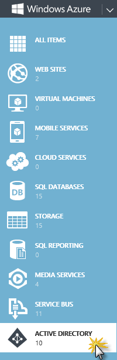

<a name="Title" />
# Introduction to Windows Azure Active Directory #

---
<a name="Overview" />
## Overview ##

In this hands-on lab you will learn how to use **Windows Azure Active Directory** for implementing web single sign-on in an ASP.NET application. The instructions will focus on taking advantage of the directory tenant associated with your Windows Azure subscription, as that constitutes the obvious choice of identity providers for Line of Business (LoB) applications in your own organization. This lab will show you how to provision the same application in a Windows Azure AD tenant, and how to configure the application's sign-on settings to connect to that tenant. At the end of the walkthrough, you will have a functioning web application fully configured for organizational single sign-on.


<a name="Objectives" />
### Objectives ###

In this hands-on lab, you will learn how to:

* Create a new Windows Azure Active Directory tenant.
* Provision an MVC application in the AD tenant.
* Configure application's sign-on and sign-out settings.
* Query Active Directory data using Graph AD API.

<a name="Prerequisites" />
### Prerequisites ###

The following is required to complete this hands-on lab:

- Windows Azure subscription - [sign up for a free trial](http://aka.ms/WATK-FreeTrial)
- [Visual Studio 2012 Professional or Visual Studio 2012 Ultimate][1]
- [Identity and Access Tools for Visual Studio 2012][2]
- [WCF Data Services 5.3 Tools][3]

[1]: http://www.microsoft.com/visualstudio
[2]: http://visualstudiogallery.msdn.microsoft.com/e21bf653-dfe1-4d81-b3d3-795cb104066e
[3]:http://www.microsoft.com/en-us/download/details.aspx?id=35840

<a name="Setup" />
### Setup ###

In order to execute the exercises in this hands-on lab you need to set up your environment.

1. Open a Windows Explorer window and browse to the lab's **Source** folder.

1. Execute the **Setup.cmd** file with Administrator privileges to launch the setup process that will configure your environment and install the Visual Studio code snippets for this lab.

1. If the User Account Control dialog is shown, confirm the action to proceed.

> Make sure you have checked all the dependencies for this lab before running the setup.

<a name="UsingCodeSnippets" />
### Using the Code Snippets ###

Throughout the lab document, you will be instructed to insert code blocks. For your convenience, most of that code is provided as Visual Studio Code Snippets, which you can use from within Visual Studio 2012 to avoid having to add it manually. 

---
<a name="Exercises" />
## Exercises ##

This hands-on lab includes the following exercises:

1.	[Adding Sign-On to Your Web Application Using Windows Azure Active Directory](#Exercise1)
1.	[Using the Graph API to Query Windows Azure Active Directory](#Exercise2)

> **Note:** Each exercise is accompanied by a starting solution. These solutions are missing some code sections that are completed through each exercise and therefore will not necessarily work if running them directly.
Inside each exercise you will also find an end folder where you find the resulting solution you should obtain after completing the exercises. You can use this solution as a guide if you need additional help working through the exercises.

Estimated time to complete this lab: **45** minutes.

> **Note:** When you first start Visual Studio, you must select one of the predefined settings collections. Every predefined collection is designed to match a particular development style and determines window layouts, editor behavior, IntelliSense code snippets, and dialog box options. The procedures in this lab describe the actions necessary to accomplish a given task in Visual Studio when using the **General Development Settings** collection. If you choose a different settings collection for your development environment, there may be differences in these procedures that you need to take into account.

<a name="Exercise1" />
### Exercise 1: Adding Sign-On to Your Web Application Using Windows Azure Active Directory ###

In the first exercise you will learn how to provision a new **Windows Azure AD** tenant within your Windows azure subscription, and how to operate the **Windows Azure AD Management Portal** features to register an application.

<a name="Ex1Task1" />
#### Task 1 - Creating a New Directory Tenant ####

In this task, you will provision a new Windows Azure Active Directory Tenant from the Management Portal.

1. Navigate to [https://manage.windowsazure.com](https://manage.windowsazure.com) using a web browser and sign in using the Microsoft Account associated with your Windows Azure account.

1. Select **Active Directory** from the left pane.

	

	_Accessing Windows Azure Active Directory_

1.	Click the **Add** button from the bottom toolbar.

	

	_Adding a new Active Directory Tenant_

1.	In the **Add Directory** dialog box, select **Create a new directory**.

	

	_Creating a New Directory_

1.	Enter a **Domain Name** (must be unique), select a **Region** and type an **Organization Name**. Click the check button to continue.

	

	_Filling Active Directory Information_

	> **Note:** This dialog gathers essential information needed to create a directory tenant for you.
	>
	> * **Organization Name**: This field is required, and its value will be used as a moniker whenever there's the need to display the company name. 
	>
	> * **Country or Region**: The value selected in this dropdown will determine where your tenant will be created. Given that the directory will store sensitive information, please do take into account the normative about privacy of the country in which your company operates. 
	>
	> * **Domain Name**: This field represents a critical piece of information: it is the part of the directory tenant domain name that is specific to your tenant, what distinguishes it from every other directory tenant. 
	>
	> 		At creation, every directory tenant is identified by a domain of the form <tenantname>.onmicrosoft.com. That domain is used in the UPN of all the directory users and in general wherever it is necessary to identify your directory tenant. After creation it is possible to register additional domains that you own. For more information, see domain management.
	>
	> * **The Domain Name must be unique**: the UI validation logic will help you to pick a unique value. It is recommended that you choose a handle which refers to your company, as that will help users and partners as they interact with the directory tenant.

1.	Wait until the Active Directory is created (its status should display **Active**).

	

	_Active Directory Tenant Creation Completed_

	> **Note:** When a directory tenant is created, it is configured to store users and credentials in the cloud. If you want to integrate your directory tenant with your on-premises deployment of Windows Server Active Directory, you can find detailed instructions [here](http://technet.microsoft.com/library/jj151781.aspx).

1.	Click on the newly created directory entry to display the user management UI. The directory tenant is initially empty, except for the Microsoft Account administering the Windows Azure subscription in which the new tenant was created.

	

	_Active Directory User List_

1. Now you will add a new user to the directory. Click the **Add User** button in the bottom bar.

	

	_Adding a new user to Active Directory_

1.	In the dialog box, keep the default option of **New user in your organization** and type a username (e.g.: _newusername_). Click **Next** to continue.

	

	_Filling new user details_

1.	Enter the user profile data. Keep the **Role** option of **User**.

	

	_Filling user profile information_

1.	The Management Portal generates a temporary password, which will have to be used at the time of the first login. At that time the user will be forced to change password. Click the **create** button. Take note of the temporary password, as you will need it in the following tasks. Click the check button to create the user.

	

	_Creating a temporary password_

	At this point we have everything we need for providing an authentication authority in our web SSO scenario: a directory tenant and a valid user in it.

<a name="Ex1Task2" />
#### Task 2 - Creating and Registering an MVC App in Active Directory Tenant ####

In this task, you will create a new MVC Application using **Visual Studio 2012** and you will register it in the Active Directory tenant you created in the previous task.

1. Open **Microsoft Visual Studio 2012** as administrator by right-clicking the **Microsoft Visual Studio 2012** shortcut and choosing **Run as administrator**.

1. From the **File** menu, choose **New Project**.  

1. In the **New Project** dialog, expand **Visual C#** in the **Installed** list and select **Web**. Choose the **ASP.NET MVC 4 Web Application** template, set the **Name** of the project to _ExpenseReport_ and set a location for the solution. Click **OK** to create the project.

	

	_Creating a new MVC 4 Application in Visual Studio 2012_

1. In the **New ASP.NET MVC 4 Project** window, select **Intranet Application**, make sure the view engine is set to **Razor**, and then click **OK**.

	

	_Selecting MVC 4 Intranet Application template_

1.	Select your project in the **Solution Explorer**, then in the **Properties** pane, switch **SSL Enabled** to _True_. Copy the **SSL URL**.

	

	_Switching Web App to use SSL_

	> **Note:** Visual Studio configures your application to serve content through HTTP. However, that would not be suitable for establishing secure sessions, given that it would leave communications unprotected and allow potential attackers to steal cookies and tokens. This is not mandatory during the development phase, as Windows Azure will not strictly enforce use of HTTPS. It is always a good practice though.

1.	Right-click the project and choose **Properties**. Choose the **Web** tab on the left, scroll down to the **Use Local IIS Web server** option and paste the HTTPS URL in the **Project Url** field. Save settings (CTRL+S) and close the property tab.

	

	_Setting the Local IIS Web Server URL_

1.	Minimize Visual Studio and go back to the **Management Portal**. Go to your Active Directory tenant and click **Applications**. Click the **Add an app** link.

	

	_Adding an Application to Active Directory_

	> **Note:** No application can take advantage of Windows Azure AD if they are not registered: this is both for security reasons (only apps that are approved by the administrator should be allowed) and practical considerations (interaction with Windows Azure AD entails the use of specific open protocols, which in turn require the knowledge of key parameters describing the app).

1.	Enter the name of your application (e.g.: _Expense Report_) and select **Single Sign-on** for the type of access. Click **Next**.

	

	_Defining Application Access Type_

1.	Enter the SSL URL from the MVC Application in both fields **APP URL** and **APP ID URI**. Click the check button to complete the application registration.

	

	_Entering Application URL_
	

	> **Note:** In this screen the Windows Azure Management Portal gathers important coordinates which the service needs to drive the sign-in protocol flow.
	>
	> * **APP URL:** This parameter represents the address of your web application. Windows Azure AD needs to know your application's address so that, after a user successfully authenticated on Windows Azure AD's pages, it can redirect the flow back to your application.
	>
	> * **APP ID URI:** this parameter represents the identifier of your web application. Windows Azure AD uses this value at sign-on time, to determine that the authentication request is meant to enable a user to access this particular application - among all the ones registered - so that the correct settings can be applied. The APP ID URI must be unique within the directory tenant. A good default value for it is the APP URL value itself, however with that strategy the uniqueness constraint is not always easy to respect: developing the app on local hosting environments such as IIS Express and the Windows Azure Fabric Emulator tend to produce a restricted range of addresses that will be reused by multiple developers or even multiple projects from the same developer.

1.	You successfully registered the application within your Active Directory tenant. In the application dashboard, copy the **Federation Metadata Document URL** from the **Enable single sign-on with Windows Azure AD** section. You will use it in the following tasks.

	

	_Copying Federation Metadata URL_

<a name="Ex1Task3" />
#### Task 3 - Connecting the application to Windows Azure Active Directory ####

In this task, you will run the Identity and Access configuration to set up your application with Windows Azure Active Directory. Visual Studio 2012 offers point and click tools which can help you to configure applications to use WS-Federation for web sign-on: you can use the tool's UI to provide few key information about the authority you want to trust for authentication, and the tool will emit the corresponding configuration entries.

1. Go back to Visual Studio, right-click the **ExpenseReport** project node and select **Identity and Access...**.

	

	_Opening Identity and Access tools_

1.	The tool lists various authority types you can use to outsource authentication. In this specific case, you will select **Business Identity Provider**. Paste the Federation Metadata URL you copied in the previous task in the **Enter the path to the STS metadata document** field. The APP ID URI will be already filled in the dialog. Press **OK** to continue.

	

	_Configuring the Business Identity Provider_

	> **Note:** As you paste in the textbox the path to the metadata document, the tool will display a warning about a certificate being invalid. That is due to the fact that the metadata document is signed with a self-signed certificate, and should not be cause for concern.

1.	The tool auto generates entries in the Web.config file. This is all you need for taking advantage of Windows Azure AD for Web sign-on. Now, you will display the authenticated user information in the Home page of the application. Open **HomeController.cs** under the **Controllers** folder. 

1. Add the following directive at the top of the class.

	````C#
	using System.Security.Claims;
	````

1. Replace the **Index** method contents with the following code.

	(Code Snippet - _Introduction to Windows Azure AD - Ex1 Querying ClaimsPrincipal_)

	<!-- mark:3-7 -->
	````C#
	public ActionResult Index()
   {            
		ClaimsPrincipal cp = ClaimsPrincipal.Current;
		string fullname = string.Format("{0} {1}", cp.FindFirst(ClaimTypes.GivenName).Value,
		cp.FindFirst(ClaimTypes.Surname).Value);
		ViewBag.Message = string.Format("Dear {0}, welcome to the Expense Note App", fullname);
		return View();
	}
	````

	> **Note:** Starting from .NET 4.5, every identity in .NET is represented with a ClaimsPrincipal. In this case, the current ClaimsPrincipal has been constructed during the validation of an authentication token generated by Windows Azure AD and presented by the user at sign-on time.

1.	Run the application by pressing **F5**.

1. A security certificate warning will appear in your browser. This is a expected behavior, click **Continue to this website (not recommended)**.

	

	_Browser displaying Security Certificate Warning_

1. The URL address bar is replaced by the one of the authority, and the user is prompted to authenticate via the Windows Azure AD UI. Use the credentials from the user you created in a previous task.

	

	_Logging in to the Application_

1.	You might recall that when you created the user in your Windows Azure AD tenant the Management Portal assigned to it a temporary password. You have to authenticate using that password. However, given that such password was meant to be temporary, during this very first sign-in operation you will be asked to choose a proper user password before being able to move forward with the authentication flow. Once you'll be done with that, the normal sign-in flow to the app will be restored.

	

	_Typing New User Password_

1. At the Home page, you can notice the username displayed at the top right of the page and the user's first and last name displayed in the center of the page.

	

	_Displaying User Name in Home Page_

	At this point your application has all you need to demonstrate web sign-on with Windows Azure AD, however it is not complete yet. There are at least other two important features you will want to add: support for sign out and automatic refresh of the authority's protocol coordinates.

<a name="Ex2Task4" />
#### Task 4 - Adding Sign Out to the MVC App ####

In this task, you will add a Sign Out Controller to the MVC app. The web sign-on protocols in use today often include provisions for performing distributed sign out operations. Those are flows in which not only the current application cancels its current user's session, but it also reaches out to the authority to signal that a sign out command should be propagated to all the other applications' sessions that might have been established by the same authority.

1. In Visual Studio, right-click the **Controllers** folder, select **Add** and then **Controller**. Name it _SignOutController_, choose **Empty MVC Controller** as **Template** and click **Add**.

	

	_Adding a SignOutController to the project_

1.	Right-click the **ExpenseReport** project node and select **Add Reference**. Select the **Assemblies** node from the left pane, type _system.identitymodel.services_ in the **Search Assemblies** field, and select the corresponding assembly from the main list. Press **OK**.

1. Open **SignOutController.cs** file and add the following directives.

	````C#
	using System.IdentityModel.Services;
	using System.IdentityModel.Services.Configuration;
	````

1.	Replace the contents of the **SignOutController** class with the following highlighted code.

	(Code Snippet - _Introduction to Windows Azure AD - Ex1 SignOutController_)

	<!-- mark:3-22 -->
	````C#
    public class SignOutControllerController : Controller
    {
        public ActionResult Index()
        {
            return View("SignOut");
        }

        public void SignOut()
        {
            WsFederationConfiguration fc =
                   FederatedAuthentication.FederationConfiguration.WsFederationConfiguration;

            string request = System.Web.HttpContext.Current.Request.Url.ToString();
            string wreply = request.Substring(0, request.Length - 7);

            SignOutRequestMessage soMessage =
                            new SignOutRequestMessage(new Uri(fc.Issuer), wreply);
            soMessage.SetParameter("wtrealm", fc.Realm);

            FederatedAuthentication.SessionAuthenticationModule.SignOut();
            Response.Redirect(soMessage.WriteQueryString());
        }
    }
	````

	> **Note:** The sample application demonstrated here does not do much, but your real applications might allocate resources during a user's session. If that is the case, you can take advantage of the SAM's events SigningOut and SignedOut by adding corresponding event handlers in the Global.asax file to clean up whatever resources should be disposed upon closing a session.

1. Right-click on the **Views** folder, select **Add** and then **New Folder**. Name it **SignOut**. 

1. Right-click the newly created **SignOut** folder, select **Add** and then **View**. Name it **SignOut** and leave the rest of the fields with the default values. Click **Add**.

	

	_Adding the SignOut View_

1.	Replace the placeholder **\<h2\>** tag with the following.

	````CSHTML
	<h2>You have successfully signed out</h2>
	````

1.	You configured the application to handle authentication via blanket redirects. That means that, if you try to access this View after a successful sign out you will be immediately redirected to Windows Azure AD to sign in again! To avoid that behavior, you can use the **\<location\>** element in the web.config to create one exception to the authentication policy. Open **Web.config**, locate the first occurrence of the **\<location\>** tag and paste the following block just below it.

	(Code Snippet - _Introduction to Windows Azure AD - Ex1 Location element_)

	<!-- mark:10-16 -->
	````XML
	<configuration>
		...
	  <location path="FederationMetadata">   
		 <system.web>
			<authorization>
			  <allow users="*" />
			</authorization>
		 </system.web>
	  </location>
	  <location path="SignOut">
		 <system.web>
			<authorization>
			  <allow users="*" />
			</authorization>
		 </system.web>
	  </location>
	</configuration>
	````

1.	Open the **_Layout.cshtml** file located under **Views | Shared** folder.

1. Locate the **\<section\>** with id _login_ and replace its contents with the following.
	
	(Code Snippet - _Introduction to Windows Azure AD - Ex1 Layout View_)

	<!-- mark:2-9 -->
	````CSHTML
	<section id="login">
		@if (Request.IsAuthenticated)
		{  
			<text> Hello, <span class="username">@User.Identity.Name</span>! 
			@Html.ActionLink("Signout","SignOut", "SignOut")</text>
		}
		else {
			<text>  You are not authenticated </text>
		}
	</section> 
	````

1. Press **F5** to run the application. Log in the application using the AD user credentials.

1. In the **Home** page, click the **Signout** button located at the top right of the page.

1. You will be signed out and you will be presented with the SignOut view.

	

	_Signed Out View_

<a name="Ex2Task5" />
#### Task 5 - Adding Automatic Metadata Refresh ####

The **Identity and Access Tool** configured your application to accept tokens coming from your Windows Azure AD tenant of choice. In order to do so, it cached in the Web.config the necessary protocol coordinates for connecting to the intended Windows Azure AD endpoints. It is common security practice to regularly renew cryptographic keys, and Windows Azure AD signing keys are no exception: at fixed time intervals the old keys will be retired, and new ones will take their place in the issuer's signing logic and in your tenant's metadata document.

To minimize downtime, it is a good idea to add self-healing logic directly in the application so that you can consume the metadata document programmatically and react to key rolling without the need of operator's intervention.

1. In Visual Studio, right-click the **ExpenseReport** project node and select **Add Reference**. Select the **Assemblies** node from the left pane and type _System.IdentityModel_ in the search box. Check the assembly and click **OK**.

1.	Open **Global.asax** file and add the following directives.

	````C#
	using System.Configuration;
	using System.IdentityModel.Tokens;
	````

1. Add the following method at the bottom of the class.

	(Code Snippet - _Introduction to Windows Azure AD - Ex1 Refresh Validation Settings_)

	````C#
	protected void RefreshValidationSettings()
	{
		 string configPath = AppDomain.CurrentDomain.BaseDirectory + "\\" + "Web.config";
		 string metadataAddress = 
							ConfigurationManager.AppSettings["ida:FederationMetadataLocation"];
		 ValidatingIssuerNameRegistry.WriteToConfig(metadataAddress, configPath);
	}
	````

	> **Note:** The **ValidatingIssuerNameRegistry** is the class used by the Identity and Access Tool to record information about which authorities are trusted, and what keys should be used to verify the tokens they issue. **WriteToConfig** is a static method that reads the issuer settings from a metadata document (in this case retrieved from config, where it was stored in the tool's first run, by the method's second line) and uses it to create or update the corresponding config section of the file at the path specified (constructed from the current **AppDomain** in the first line of the method).

1.	Insert a call to the **RefreshValidationSettings** method at the end of the **Application_Start** method.
	
	<!-- mark:9 -->
	````C#
	protected void Application_Start()
	{
		 AreaRegistration.RegisterAllAreas();

		 WebApiConfig.Register(GlobalConfiguration.Configuration);
		 FilterConfig.RegisterGlobalFilters(GlobalFilters.Filters);
		 RouteConfig.RegisterRoutes(RouteTable.Routes);
		 BundleConfig.RegisterBundles(BundleTable.Bundles);
		 RefreshValidationSettings();
	}
	````

	> **Note:** Calling **RefreshValidationSettings** from **Application_Start** guarantees that the Web.config will be modified in a safe time, whereas if you would do that later in the app's lifecycle you'd risk triggering a refresh.

<a name="Exercise2"></a>
### Exercise 2: Using the Graph API to Query Windows Azure Active Directory ###

This exercise builds upon the previous one and will show how to add capability to read directory data using the **Windows Azure AD Graph API**. The Graph API is a new RESTful API that allows applications to access customers' Windows Azure directory data.

<a name="Ex2Task1" />
#### Task 1 - Configuring Application Authorization and Authentication for the Graph API ####

In this task you will update the application configuration in the Management Portal to enable the MVC application to authenticate and be authorized to call the Graph API. With authorization, you configure your app permissions to allow read/write access to the directory. With authentication, you get an Application Key, which is your application's password and will be used to authenticate your application to the Graph API.

1. Log on to the [Windows Azure Management Portal](https://manage.windowsazure.com), select **Active Directory** from the left pane and click the application name you created in the previous exercise.

	

	_Selecting Application Name_

1. Click **Manage Access** on the bottom toolbar.

	

	_Manage Access Button_

1. On the **What do you want to do?** screen, select **Change the directory access for this app**.

	

	_Changing the Directory Access for the App_

1. On the **Directory access required by this app** screen, select the radio button next to **SINGLE SIGN-ON, READ DIRECTORY DATA**, and then click the check button in the bottom right-hand corner of the screen to save your changes.

	

	_Selecting Directory Access for the App_

1. From the main application page, expand **Enable your app to read or write directory data** and select the **Configure key** option under the CREATE A KEY section.

	

	_Configuring Key for Read and Write_

1. In the **Configure** page, under the **Keys** section, add a key by selecting the key's lifespan (default 1 year), and then click **Save** at the bottom of the screen. This will generate a key value that is your application's password and will be used in the application configuration.

	> **Note:** The key value is displayed after key creation, but cannot be retrieved later. Therefore, you should immediately copy the key value and store it in a secure place for your future reference. Also, your application can have multiple keys. For example, you may want one or more for testing and production.

	

	_Generating Key for Read and Write_

<a name="Ex2Task2" />
#### Task 2 - Including Graph API Helper in MVC App ####

In this task you will add the Graph API Helper to your MVC app. This helper is a  class project that includes a library and classes that facilitate authenticating to and calling the Graph API.

1. Download the **Graph API Helper** project from http://go.microsoft.com/fwlink/?LinkID=290812.

1. If not already open, start **Visual Studio 2012 Professional or Ultimate** and continue with the solution obtained from the previous exercise. Alternatively, you can open the **Begin.sln** solution from the **Source\Ex2-UsingGraphAPIWithWAAD\Begin** folder of this lab.

	> **Note:** If you opened the **Begin.sln** solution, you need to **enable SSL** from the properties of the ExpenseReport project; update the **project URL** in the **Web** tab of the ExpenseReport project properties in the _Use Local IIS Web server_ section with the SSL URL obtained from the previous step; update the **App URL** of the configured application in the Windows Azure Management Portal with the SSL URL obtained from the first step; and Run the **Identity and Access** wizard over the ExpenseReport project selecting the **Use a business identity provider** and updating the **Federation Metadata URL** placeholder with the one located in the configured application in the Windows Azure Management Portal and the **APP ID URI** placeholder with the value obtained from the first step. Also, in the **Web.config** file, update the _[YOUR-APP-ID-URL]_ placeholder in the federation configuration element with the URL obtained from the first step. For more information, check [Task 2](#Ex1Task2) and [Task 3](#Ex1Task3) from exercise 1.

1. To add the Graph API Helper to the single sign-on project, right-click the solution, click **Add | Existing Project**.

1. From the **Add Existing Project** dialog, navigate to the folder where you downloaded the Graph API Helper and open the **Microsoft.WindowsAzure.ActiveDirectory.GraphHelper.csproj** project file.

1. Open the Web.config file of the **ExpenseReport** project. Add the following key values to the appSettings section. Make sure you update the _[YOUR-CLIENT-ID]_ placeholder with the **Client ID** value obtained from the **Configure** tab of your application in the Windows Azure Management Portal and the _[YOUR-APPLICATION-KEY-VALUE]_ placeholder with the key that you generated in the previous task.

	<!-- mark:2-3 -->
	````XML
	<appSettings>
		<add key="ClientId" value="[YOUR-CLIENT-ID]"/>
		<add key="Password" value="[YOUR-APPLICATION-KEY-VALUE]"/>
		...
	<appSettings>
	````

1. Save the **Web.config** file after making the changes.

1. In the next steps, you will update the **Microsoft.Data.Edm**, **Microsoft.Data.OData** and **System.Spatial** references from version _5.2.0_ to version _5.3.0_. From the **ExpenseReport** project, expand the **References** folder and delete the **Microsoft.Data.Edm**, **Microsoft.Data.OData** and **System.Spatial** references.

	> **Note:** This is necessary because the Graph API Helper is using a newer version (5.3.0) of those assemblies.

1. Right-click the **References** folder of the **ExpenseReport** project and click **Add Reference**.

1. On the **Reference Manager** dialog, click **Extensions** from the left menu, then select the **Microsoft.Data.Edm**, **Microsoft.Data.OData**, **System.Spatial** and the **Microsoft.Data.Services.Client** version 5.3.0.0 assemblies.

	

	_Microsoft Data References_

1. In the same **Reference Manager** dialog, expand the **Solution** menu on the left and then select the checkbox for the **Microsoft.WindowsAzure.ActiveDirectory.GraphHelper**. Click **OK** to add the references.

	

	_Graph API Helper Reference_

<a name="Ex2Task3" />
#### Task 3 - Displaying Active Directory Query Data ####

In this task you will update the **HomeController** of your MVC app to query the list of users from the Active Directory tenant using the Graph API Helper, and create a view to display the results.

1. In the **Solution Explorer**, expand the **Controllers** folder of the **ExpenseReport** project and open the **HomeController.cs**. Add the following assemblies to the file and then save it.

	(Code Snippet - _Introduction to Windows Azure AD - Ex2 Home Controller References_)

	````C#
	using System.Configuration;
	using System.Security.Claims;
	using System.Data.Services.Client;
	using Microsoft.WindowsAzure.ActiveDirectory;
	using Microsoft.WindowsAzure.ActiveDirectory.GraphHelper;
	````

1. Add the following action method at the end of the **HomeController** class, which will retrieve the list of users from the Active Directory tenant using the Graph API Helper to obtain a JWT (JSON Web Token). This token is inserted in the Authorization header of subsequent requests from the Graph API.

	(Code Snippet - _Introduction to Windows Azure AD - Ex2 Users Action Method_)

	<!-- mark: 5-49 -->
	````C#
	public class HomeController : Controller
	{
		...

		public ActionResult Users()
		{
			//get the tenantName
			string tenantName = ClaimsPrincipal.Current.FindFirst("http://schemas.microsoft.com/identity/claims/tenantid").Value;

			// retrieve the clientId and password values from the Web.config file
			string clientId = ConfigurationManager.AppSettings["ClientId"];
			string password = ConfigurationManager.AppSettings["Password"];

			// get a token using the helper
			AADJWTToken token = DirectoryDataServiceAuthorizationHelper.GetAuthorizationToken(tenantName, clientId, password);

			// initialize a graphService instance using the token acquired from previous step
			DirectoryDataService graphService = new DirectoryDataService(tenantName, token);

			//  get Users
			//
			var users = graphService.users;
			QueryOperationResponse<User> response;
			response = users.Execute() as QueryOperationResponse<User>;
			List<User> userList = response.ToList();
			ViewBag.userList = userList;

			//  For subsequent Graph Calls, the existing token should be used.
			//  The following checks to see if the existing token is expired or about to expire in 2 mins
			//  if true, then get a new token and refresh the graphService
			//
			int tokenMins = 2;
			if (token.IsExpired || token.WillExpireIn(tokenMins))
			{
				 AADJWTToken newToken = DirectoryDataServiceAuthorizationHelper.GetAuthorizationToken(tenantName, clientId, password);
				 token = newToken;
				 graphService = new DirectoryDataService(tenantName, token);
			}

			//  get tenant information
			//
			var tenant = graphService.tenantDetails;
			QueryOperationResponse<TenantDetail> responseTenantQuery;
			responseTenantQuery = tenant.Execute() as QueryOperationResponse<TenantDetail>;
			List<TenantDetail> tenantInfo = responseTenantQuery.ToList();
			ViewBag.OtherMessage = "User List from tenant: " + tenantInfo[0].displayName;

			return View(userList);
		}
	}
	````

	> **Note:** It is recommended that the JWT token is cached by the application for subsequent calls – in this block, the JWT token expiration is checked before making a second Graph API call. If the token is expired, then a new token is acquired. If a call to the Graph API is made with an expired token, the following error response will be returned, and the client should request a new token.

1. Now you will add a new view to display the list of users retrieved from the Active Directory tenant. To do this, expand the **Views** folder of the **ExpenseReport** project, right-click the **Home** folder and select **Add | View**. In the **Add View** dialog, set the view name to _Users_ and click **Add**.

	

	_Adding Users View_

1. Replace the code of the **Users** view with the following block.

	(Code Snippet - _Introduction to Windows Azure AD - Ex2 Users View_)

	````CSHTML
	@model IEnumerable<Microsoft.WindowsAzure.ActiveDirectory.User> 
	@{
		 ViewBag.Title = "Users";
	}

	<h1>@ViewBag.Message</h1>
	<h2>@ViewBag.OtherMessage</h2>
	<table>
		 <tr>
			  <th>
					DisplayName
			  </th>
			  <th>
					UPN
			  </th>
			  <th></th>
		 </tr>

	@if (User.Identity.IsAuthenticated)
	{

	  foreach (var user in Model) {
		 <tr>
			  <td>
				@Html.DisplayFor(modelItem => user.displayName)    
			  </td>
			  <td>
				@Html.DisplayFor(modelItem => user.userPrincipalName)
			  </td>
		</tr>
	  }
	}
	</table>
	````

1. In the **Solution Explorer**, expand the **Views/Shared** folder and open **_Layout.cshtml**. Find the **\<nav\>** element inside the **\<header\>** section and add the following highlighted action link to the _Users_ action method of the **HomeController**.

	<!-- mark:6 -->
	````CSHTML
	<nav>
		<ul id="menu">
			 <li>@Html.ActionLink("Home", "Index", "Home")</li>
			 <li>@Html.ActionLink("About", "About", "Home")</li>
			 <li>@Html.ActionLink("Contact", "Contact", "Home")</li>
			 <li>@Html.ActionLink("Users", "Users", "Home")</li>
		</ul>
	</nav>
	````

<a name="Ex2Verification" />
#### Verification ####

1. Press **F5** to run the application. The single sign-on experience is the same as you saw in the previous exercise, requiring authentication using your Windows Azure AD credentials.

1. Once you have successfully authenticated using your credentials, select the **Users** tab from the top right menu.

	

	_Users Action Link_

1. You should see the _Users_ view displaying the list of users from the Active Directory tenant.

	

	_Displaying Users From AD Tenant_

---

<a name="summary" />
## Summary ##

By completing this hands-on lab you have learned how to:

* Create a new Windows Azure Active Directory tenant.
* Provision an MVC application in the AD tenant.
* Configure application's sign-on and sign-out settings.
* Query Active Directory data using Graph AD API.
